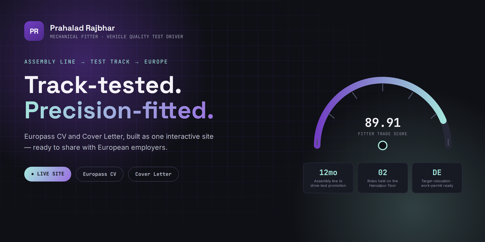

<div align="center">



<br><br>

<a href="https://YOUR-USERNAME.github.io/prahalad-rajbhar-cv/">
  
</a>
&nbsp;
<a href="https://YOUR-USERNAME.github.io/prahalad-rajbhar-cv/#cv">
  
</a>
&nbsp;
<a href="https://YOUR-USERNAME.github.io/prahalad-rajbhar-cv/#cover">
  
</a>

<br><br>


</div>

<br>

> **⚠️ Before this looks right:** replace `PR-WebSpider` in the three buttons above
> with your actual GitHub username once the repo is live, so the buttons point at the
> real site. Same goes for the `og:url` note at the very bottom of this file.

<br>

## 🧭 About this site

A single-page career site for **Prahalad Rajbhar** — Mechanical Fitter and Vehicle
Quality Test Driver at Maruti Suzuki India Limited, currently targeting employer-sponsored
relocation to Germany and the EU.

The whole page is styled like an **automotive instrument cluster** — gauges, test-log
checkpoints, fuel-style language meters — because that's literally the job: reading
dials and catching faults on a test track before a car leaves the line.

It has two views, switchable with the toggle in the top bar:

| View | What's in it |
|---|---|
| 🪪 **Europass CV** | Personal info, work experience as a test-log timeline, education, skills, language self-assessment, mobility/relocation |
| ✉️ **Cover Letter** | A ready-to-send letter with bracketed fields (`[ Company Name ]`, `[ Position Title ]`) to swap in per application |

Both are also downloadable as polished PDFs directly from the page.

<br>

## ⚙️ Tech stack

Plain **HTML / CSS / JavaScript** — no framework, no build step, no dependencies.
Open `index.html` in a browser and the whole thing just works.

<br>

## 📁 File structure

```text
.
├── index.html                          → the page: CV panel + Cover Letter panel + toggle
├── styles.css                          → design system (colors, type, layout, gauge animation)
├── script.js                           → tab switching, keyboard nav, #cv / #cover deep links
├── README.md                           → this file
├── GitHub_Pages_Publishing_Guide.pdf   → illustrated step-by-step publishing walkthrough
└── assets/
    ├── avatar.png                          → circular duotone portrait
    ├── banner.png                          → README banner image (this page, top)
    ├── Prahalad_Rajbhar_Europass_CV.pdf     → downloadable CV
    └── Prahalad_Rajbhar_Cover_Letter.pdf    → downloadable cover letter
```

<br>

## 🚀 Publishing this site

Full illustrated walkthrough: **[`GitHub_Pages_Publishing_Guide.pdf`](GitHub_Pages_Publishing_Guide.pdf)**

Short version:

1. Create a new **public** repository on GitHub.
2. Upload `index.html`, `styles.css`, `script.js`, `README.md` and the `assets/` folder
   so they sit at the **repository root** — not nested inside another folder.
3. Go to **Settings → Pages** → Source: **Deploy from a branch** → Branch: **main**, folder **/ (root)** → **Save**.
4. Wait a minute, then visit `https://<your-username>.github.io/<repo-name>/`.

<br>

## ✏️ Updating content later

| To change... | Edit this |
|---|---|
| CV or cover letter text | `index.html` — look for `<section id="panel-cv">` and `<section id="panel-cover">` |
| Colors, fonts, spacing | the `:root { ... }` block at the top of `styles.css` |
| Photo | replace `assets/avatar.png`, keep the same filename |
| Downloadable PDFs | replace the two files in `assets/`, keep the same filenames |

<br>

## 🎨 Palette

<div align="center">

| | Hex | Role |
|---|---|---|
|  | `#723EC3` | Primary — purple |
|  | `#A5E9DD` | Secondary — mint |
|  | `#FFFFFF` | Paper / document background |
|  | `#0F1016` | Dashboard ink background |

</div>

<br>

## 📬 Contact

**Prahalad Rajbhar** — Ballia, Uttar Pradesh, India
📧 [prahaladrajbhar4@gmail.com](mailto:prahaladrajbhar4@gmail.com) · 📱 +91 63868 28502

<br>

<div align="center">
<sub>Built for direct sharing with European employers · Last updated 2026</sub>
</div>
